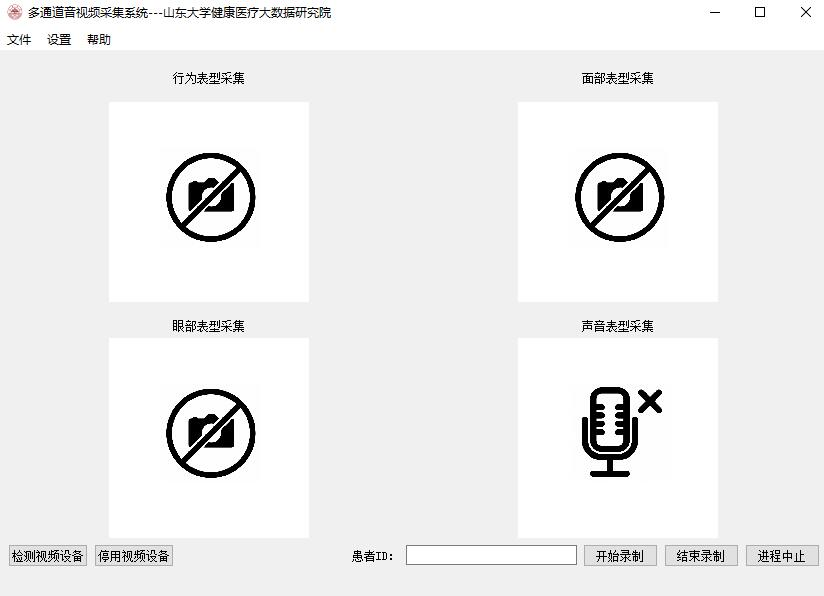

# Multi-channel-camera

多通道音视频采集系统，程序可同时采集保存多路音视频数据。启动程序后界面如下图所示。

配置文件为config/db.json，可对摄像头通道、音频通道、分辨率、fps、存储路径进行配置修改。
## 运行环境Python3📃

- PyQt5
- numpy 
- opencv-python
- threading
- threadpool
- PyAudio
- Pygame

## 使用说明
使用的时候请点击《检测视频设备》进行初始化检测摄像头信息。 
